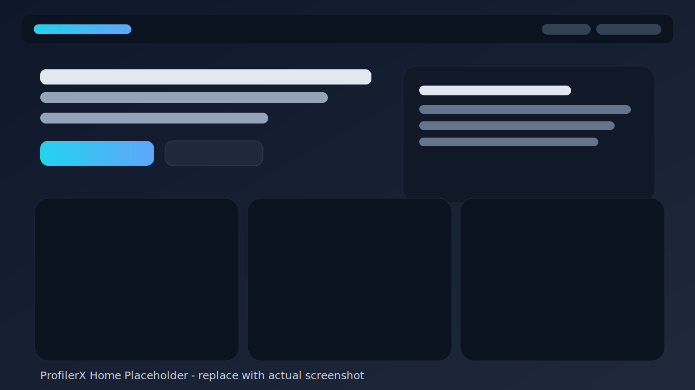
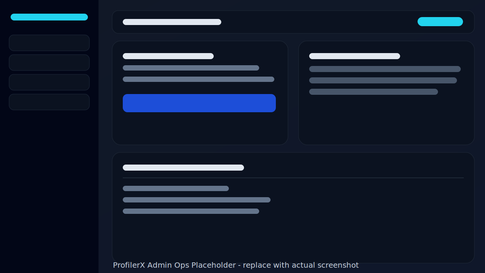
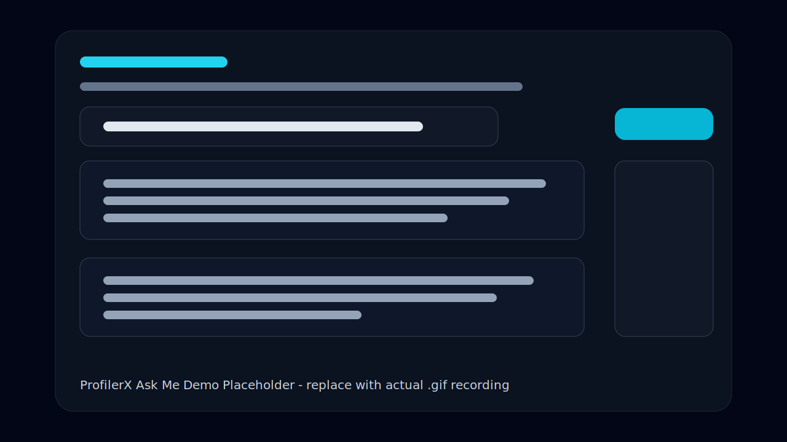

# ProfilerX - AI-Powered Portfolio Intelligence Platform

ProfilerX is a full-stack portfolio platform that combines a modern React UI, a secure Spring Boot API, and an AI assistant to present a professional profile in an interactive, recruiter-friendly format.

This project supports:
- dynamic profile rendering from structured data
- AI Q&A ("Ask Me") and interview simulation mode
- resume generation (compact and detailed PDF)
- lead capture and profile sharing via email
- admin-managed profile editing, operations, and system settings
- analytics and intent tracking for candidate engagement insights

---

## Why This Project

Traditional portfolio sites are static. ProfilerX is built as an adaptive profile experience with:
- content management for quick updates
- AI augmentation for interactive conversations
- operational controls for secure publishing and outreach
- analytics signals to measure engagement and conversion intent

---

## Key Features

- **Public Portfolio Experience**
  - responsive landing page with modular sections
  - portfolio narrative: about, experience, projects, skills, hobbies, contact
  - dynamic profile photo serving
  - downloadable resume PDFs (`compact` and `detailed`)

- **AI Experience**
  - ask questions about the profile through `/api/ask` (browser traffic can be served by a dedicated Helidon chat-bot in Docker; see `chat-bot-service/`)
  - interview mode support for role-oriented Q&A
  - pluggable AI providers (Ollama / Google Gemini)

- **Admin Console**
  - secure admin login (HTTP Basic on backend APIs)
  - resume upload + structured profile extraction
  - profile photo upload
  - profile content editing and save flow
  - email pack attachment management (2 slots)
  - system settings management and config health checks
  - audit dashboard + intent summary endpoints

- **Engagement & Outreach**
  - activity tracking (`/api/analytics/track`)
  - intent scoring (`/api/analytics/intent`)
  - profile email sending (`/api/send-profile`)
  - rate-limiting/protection filters for sensitive endpoints

---

## Tech Stack

### Frontend
- React 18
- Vite 5
- Tailwind CSS
- Axios
- React Router
- Zustand
- Framer Motion
- DOMPurify

### Backend
- Java 17
- Spring Boot 3.2
- Spring Web
- Spring Security
- Spring Data JPA
- Bean Validation
- H2 (file-based)
- PDFBox (PDF generation)
- Apache POI (DOCX/text extraction pipeline support)

### Chat Bot Service
- Java 17
- Helidon SE 3.2 (standalone `/api/ask` and LLM orchestration)
- Calls Spring internal APIs with a shared server-to-server key (`PORTFOLIO_INTERNAL_API_KEY`)

### Architecture & Integrations
- REST APIs (JSON + multipart)
- AI provider integration (Ollama / Gemini)
- Brevo SMTP API integration for transactional email
- Geo/IP-aware request processing and analytics hooks
- Optional edge cache purge hook (OpenResty in the frontend image; see `docker-compose.yml` comments)

---

## Project Structure

```text
profiler-x/                      # repository root (name may differ after clone)
  backend/                       # Spring Boot API and business logic
    src/main/java/com/bhavesh/portfolio/
      controller/               # REST controllers
      service/                  # Core services
      repository/               # JPA repositories
      entity/                   # Persistence models
      config/                   # Security + properties + app boot config
      security/                 # Request protection filters
      ai/                       # LLM client and resume extraction
      dto/                      # API contracts
    src/main/resources/
      application.yml              # Application configuration
  chat-bot-service/                # Helidon SE service for /api/ask (Docker + prod deploys)
  frontend/                        # React + Vite UI (OpenResty + static assets in Docker)
    src/
      pages/                       # Route pages
      components/                  # UI components
      services/                    # API client and utility calls
      store/                       # Zustand state
      hooks/                       # Custom hooks
      utils/                       # Utility functions
  data/                            # Optional local runtime data (non-Docker dev)
  docker-data/                     # Bind-mounted data when using docker-compose (H2, uploads, logs)
```

---

## Local Development Setup

## 1) Prerequisites

- Java 17+
- Maven 3.9+
- Node.js 18+ (or newer LTS)
- npm 9+

## 2) Clone and Install

```bash
git clone <your-repo-url>
cd profiler-x
```

Backend:
```bash
cd backend
mvn clean install
```

Frontend:
```bash
cd ../frontend
npm install
```

## 3) Configure Environment

Do not store credentials in source files.

Use environment variables for sensitive values:
- `ADMIN_USERNAME`
- `ADMIN_PASSWORD`
- `BREVO_API_KEY`
- `BREVO_SENDER_EMAIL`
- `MAIL_PASSWORD`
- `GEMINI_API_KEY` (optional bootstrap; prefer Admin → AI)

Docker / chat-bot (when running the full stack in Compose or matching prod):
- `PORTFOLIO_INTERNAL_API_KEY` (must match between `backend` and `chat-bot` services)
- `CACHE_PURGE_SECRET` and `PORTFOLIO_EDGE_PROXY_CACHE_PURGE_URL` (optional; edge cache purge)

Detailed configuration guide: [`docs/CONFIGURATION.md`](docs/CONFIGURATION.md)

## 4) Run the Application

Backend:
```bash
cd backend
mvn spring-boot:run
```

Frontend (new terminal):
```bash
cd frontend
npm run dev -- --host
```

Default local URLs:
- frontend: `http://localhost:5173`
- backend: `http://localhost:8080`

---

## Run with Docker Compose (full stack)

For an integrated local stack (Spring + Helidon chat-bot + OpenResty frontend), use Docker from the repository root.

**Prerequisites:** Docker Engine and Docker Compose v2.

```bash
docker compose up --build
```

Typical URLs (see `docker-compose.yml` for port bindings and env notes):
- **Public site (frontend):** `http://localhost:8088` — proxies `/api` to the backend and Ask traffic to the chat-bot as configured in the image
- **Backend:** `http://localhost:8080`
- **Chat-bot:** `http://localhost:8081`

Runtime files (H2 database, email-pack attachments, profile photo, logs) are stored under `./docker-data` on the host (bind-mounted to `/data` in the backend container). Read the comments at the top of `docker-compose.yml` for production-profile and purge-cache behavior.

---

## Build for Production

Frontend:
```bash
cd frontend
npm run build
```

Backend:
```bash
cd backend
mvn clean package
```

Production run (example):
```bash
cd backend
set SPRING_PROFILES_ACTIVE=prod
set PROD_ALLOWED_ORIGINS=https://your-frontend.example.com
set PUBLIC_SITE_URL=https://your-frontend.example.com
set ADMIN_USERNAME=<admin-user>
set ADMIN_PASSWORD={bcrypt}<hash>
mvn spring-boot:run
```

For Linux/macOS, use `export` instead of `set`.

If required production variables are insecure/missing, the app fails fast on startup with a clear safety message.

### CI/CD (reference)

On push to `main` or `helidon-integration`, [`.github/workflows/deploy.yml`](.github/workflows/deploy.yml) builds Docker images for **backend**, **chat-bot**, and **frontend**, pushes them to **Amazon ECR**, and runs a **blue-green deploy** on EC2 via SSH (repository secrets required: AWS credentials, ECR account/region, server IP, SSH key, etc.).

---

## Screenshots & GIF Preview

> Replace these placeholder visuals with your real product screenshots/GIF recordings at the same paths.

### Public Portfolio (Desktop)



### Admin Console



### Ask Me AI Demo



Suggested final media files (recommended):
- `docs/assets/screenshots/home.png`
- `docs/assets/screenshots/experience.png`
- `docs/assets/screenshots/projects.png`
- `docs/assets/screenshots/admin-edit.png`
- `docs/assets/gifs/askme-demo.gif`
- `docs/assets/gifs/interview-mode.gif`

---

## API Documentation

Detailed endpoint documentation (public + admin), payload contracts, auth expectations, and response semantics:

- [`docs/API_REFERENCE.md`](docs/API_REFERENCE.md)

---

## Architecture Documentation

System-level design, module responsibilities, request flows, and runtime data behavior:

- [`docs/ARCHITECTURE.md`](docs/ARCHITECTURE.md)

---

## Security Notes

- Admin endpoints are protected by HTTP Basic auth at `/api/admin/**`.
- Public endpoints are explicitly allowed for profile, resume, ask, analytics, and send-profile flows.
- Sensitive values should be supplied via environment variables or protected runtime configuration.
- Do not commit real API keys, usernames, passwords, or private endpoints to Git.

---

## Suggested GitHub Description

**ProfilerX** - AI-powered portfolio platform with React + Spring Boot, interactive Q&A, resume generation, admin CMS, and engagement analytics.

---

## License

Licensed under the Apache License 2.0. See [`LICENSE`](LICENSE).
