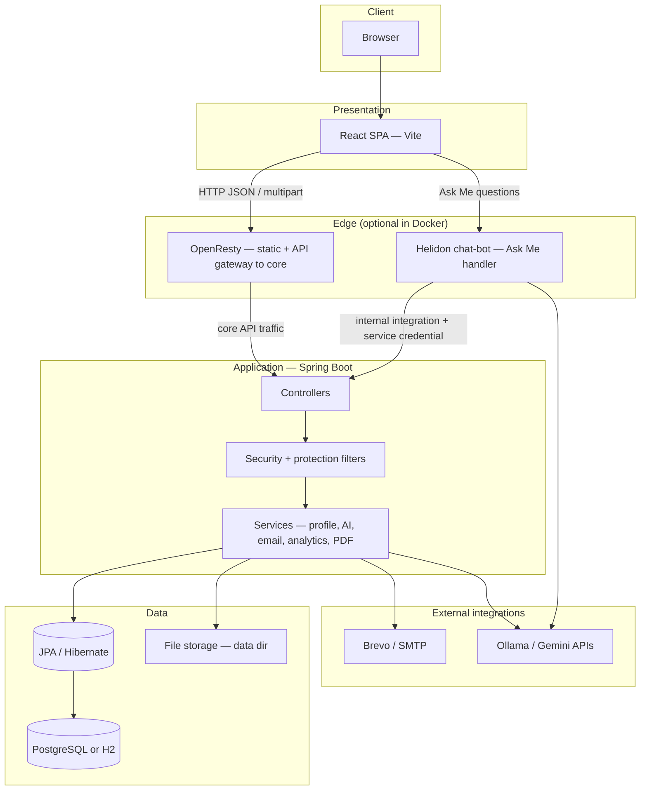
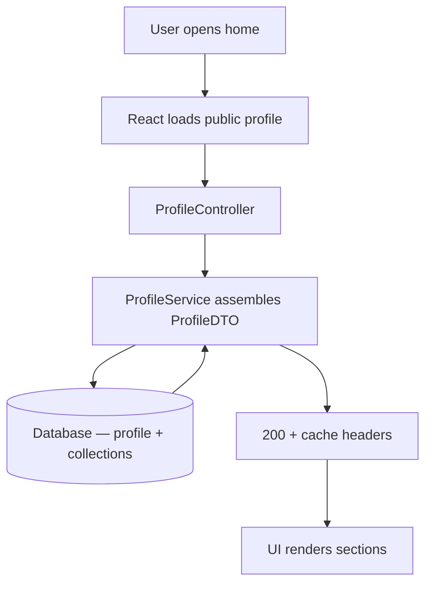
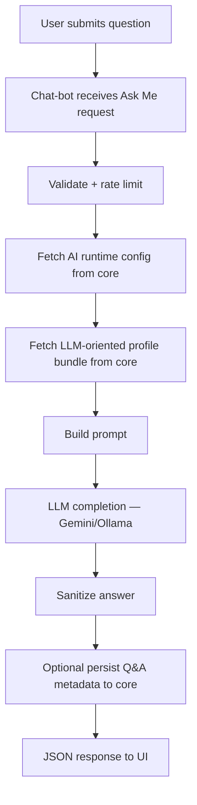
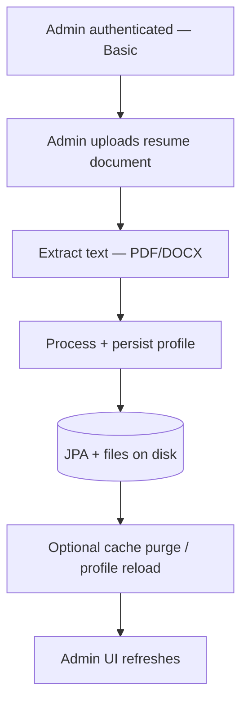
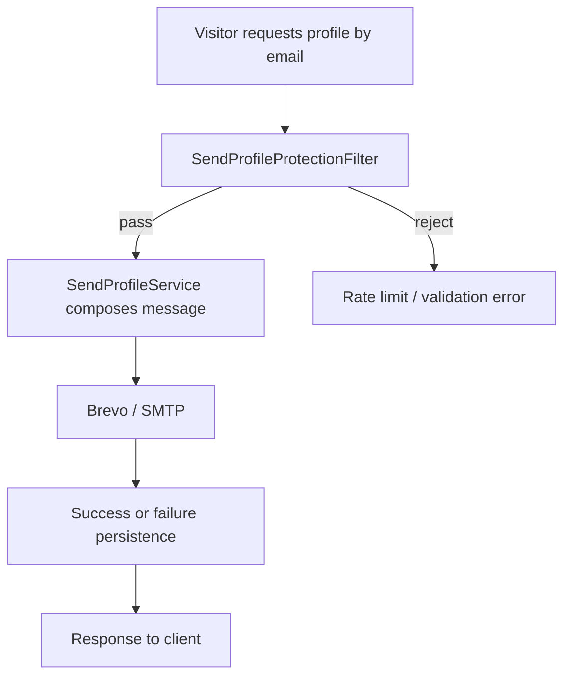
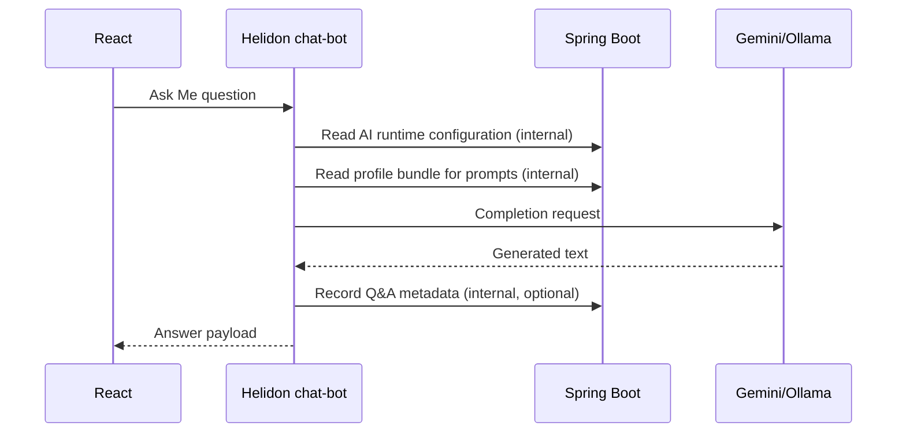

# ProfilerX — Architecture & Flow Diagrams

Visual reference for system topology, technology choices, and main request paths. For narrative detail see [ARCHITECTURE.md](./ARCHITECTURE.md) and [LOW_LEVEL_DESIGN.md](./LOW_LEVEL_DESIGN.md).

---

## Technology overview

ProfilerX is a **decoupled SPA + REST API** portfolio platform with an optional **dedicated chat edge** for LLM traffic in Docker.

| Layer | Technologies | Purpose |
|--------|----------------|---------|
| **Public UI** | React 18, Vite 5, Tailwind CSS, React Router, Zustand, Axios, Framer Motion, DOMPurify, react-quill | Portfolio pages, Ask Me UI, admin console; centralized API client and local Basic-auth token handling |
| **Edge (Docker)** | OpenResty (nginx + Lua) in `frontend` image | Static assets, reverse proxy of browser API traffic to Spring Boot; optional cache purge hook from backend |
| **Core API** | Java 17, Spring Boot 3.2, Spring Web, Spring Security, Spring Data JPA, Bean Validation | REST endpoints, HTTP Basic for admin, JPA persistence, DTO contracts |
| **Chat edge** | Java 17, Helidon SE 3.2 (`chat-bot-service`) | Ask Me handler on a worker pool; server-to-server calls into Spring Boot internal integration surface; invokes Gemini/Ollama |
| **Persistence** | Spring Data JPA, Hibernate | Entities and repositories; schema evolution via configured `ddl-auto` |
| **Database** | PostgreSQL (typical in Compose/prod) or H2 file (local/dev options) | Profile aggregate, analytics, audit, bot history, email bookkeeping, system settings |
| **Files** | Paths under `PORTFOLIO_DATA_DIR` | Profile photo, email-pack attachments, generated PDFs — kept on disk with DB metadata |
| **Documents** | PDFBox, Apache POI | Resume PDF generation; PDF/DOCX text extraction on admin upload |
| **Email** | Brevo HTTP API (`BrevoTransactionalMailService`), optional JavaMail SMTP | Transactional mail and profile pack delivery |
| **AI** | Pluggable Gemini / Ollama | Backend `LlmClient`; chat-bot `LlmHttpClient` for completions |
| **Ops** | Docker Compose, GitHub Actions (`deploy.yml`) | Local/prod topology and deploy automation |

**Cross-cutting:** CORS from `portfolio.cors.allowed-origins`; shared server secret for chat-bot → Spring internal integration; servlet filters for rate limits on Ask Me, intent scoring, and profile-email flows.

---

## System architecture (logical layers)



---

## Runtime topology (Docker Compose — conceptual)

```mermaid
flowchart LR
  Browser[Browser]
  FE[frontend :80 — OpenResty]
  CB[chat-bot :8081 — Helidon]
  BE[backend :8080 — Spring Boot]
  DB[(PostgreSQL or H2 volume)]
  LLM[Ollama / Gemini]
  Brevo[Brevo API / SMTP]

  Browser --> FE
  FE -->|proxied API to core| BE
  Browser -->|Ask Me| CB
  CB -->|internal integration (authenticated)| BE
  BE --> DB
  BE --> Brevo
  CB --> LLM
  BE -.->|optional AI from core| LLM
```

---

## Request flow — public profile load



---

## Request flow — Ask Me (Docker path via Helidon)



---

## Request flow — admin resume upload (simplified)



---

## Request flow — send profile email



---

## Sequence — Ask Me (chat-bot and core)



---
